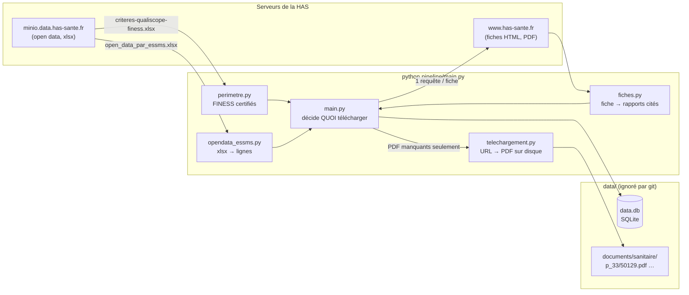
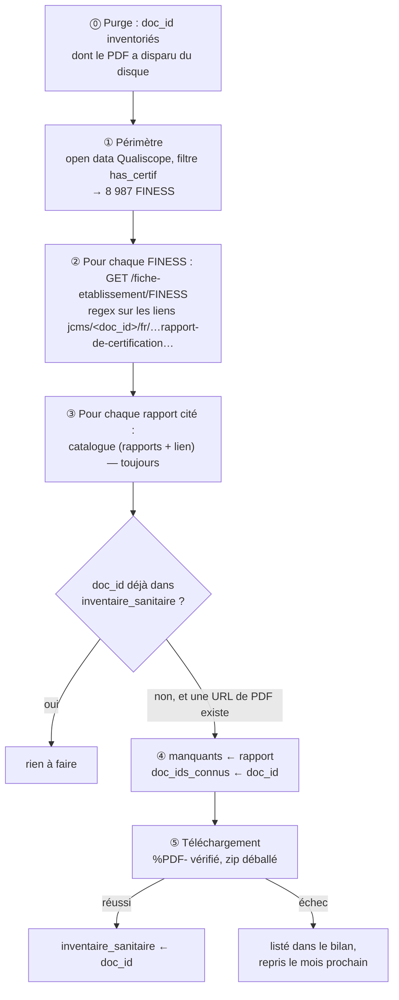
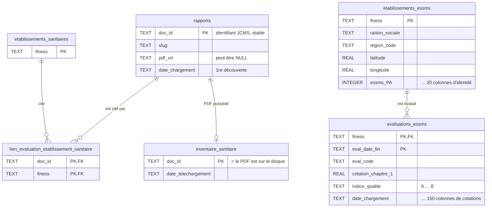
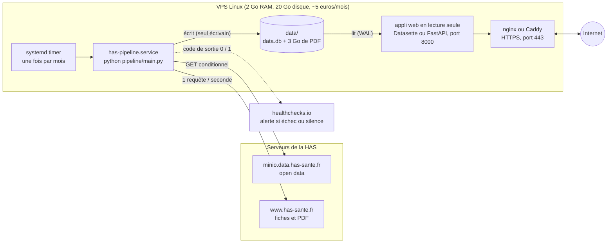
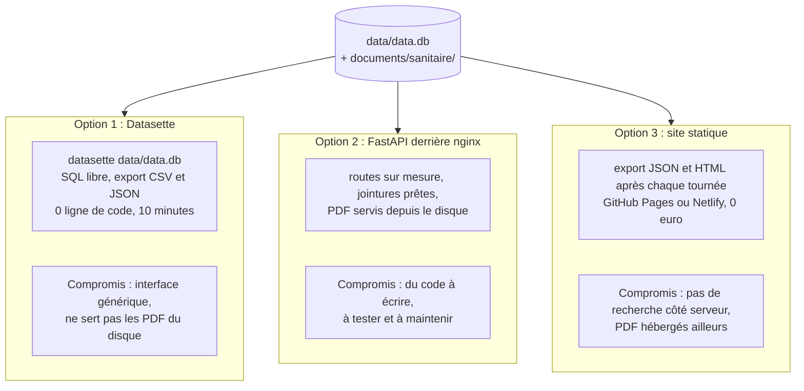
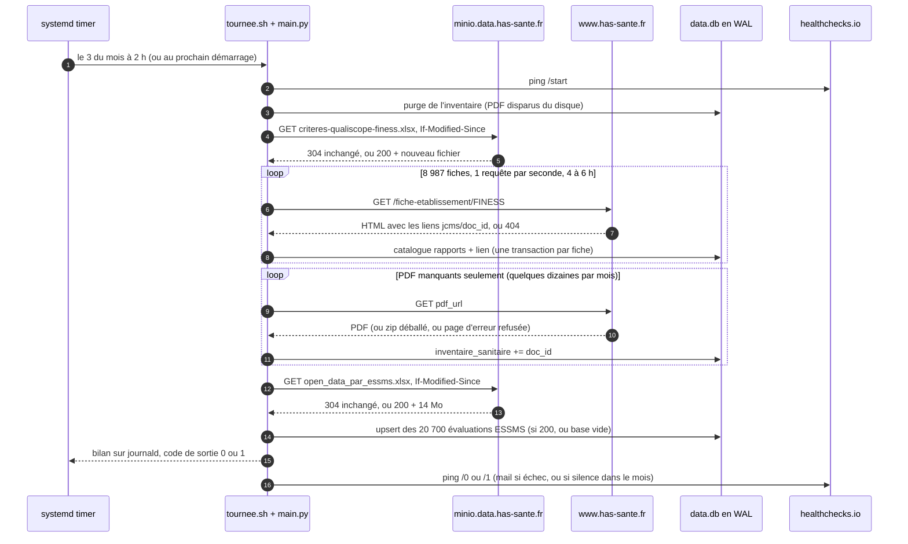

# has-pipeline — collecte mensuelle des rapports de certification de la HAS

> Une tournée, une fois par mois, qui **ne télécharge que ce qui manque** : les rapports
> de certification des établissements de santé (PDF, secteur *sanitaire*) et les
> évaluations des établissements sociaux et médico-sociaux (open data, secteur *ESSMS*),
> le tout rangé dans une base SQLite.
>
> Ce README a été rédigé avec Claude (Anthropic), à partir du code et des notes de
> travail du projet.

---

## Sommaire

1. [Ce que ça fait, en une image](#1-ce-que-ça-fait-en-une-image)
2. [État du projet : ce qui fonctionne](#2-état-du-projet--ce-qui-fonctionne)
3. [Installation et lancement](#3-installation-et-lancement)
4. [⚠️ Blocage d'IP : à lire avant de lancer une tournée complète](#4-️-blocage-dip--à-lire-avant-de-lancer-une-tournée-complète)
5. [Comment la tournée repère les nouveaux fichiers à télécharger](#5-comment-la-tournée-repère-les-nouveaux-fichiers-à-télécharger)
6. [La base de données](#6-la-base-de-données)
7. [Structure du code](#7-structure-du-code)
8. [Tests](#8-tests)
9. [Limites connues et pistes](#9-limites-connues-et-pistes)
10. [Faire tourner le projet en autonomie et l'exposer comme un site web](#10-faire-tourner-le-projet-en-autonomie-et-lexposer-comme-un-site-web)

---

## 1. Ce que ça fait, en une image

La Haute Autorité de Santé (HAS) publie deux choses que ce projet collecte :

- **Sanitaire** (hôpitaux, cliniques…) : la HAS publie une *fiche* par établissement sur
  `www.has-sante.fr`, et chaque fiche cite les *rapports de certification* en PDF. Il n'existe
  **aucune liste** de ces PDF : il faut visiter les fiches une par une.
- **ESSMS** (EHPAD, foyers, services sociaux…) : la HAS publie un **tableau open data**
  (`open_data_par_essms.xlsx`, ~14 Mo, ~20 700 lignes) qui contient déjà tout — l'identité
  des établissements *et* les cotations de chaque évaluation. Rien à crawler.



---

## 2. État du projet : ce qui fonctionne

Le projet a été **éprouvé en réel** sur les serveurs de la HAS. État de la base livrée
avec le code (`data/data.db`, non versionnée) au 2 septembre 2026 :

| Table | Lignes | Ce que ça veut dire |
|---|---:|---|
| `etablissements_sanitaires` | 4 204 | fiches visitées qui citent au moins un rapport |
| `rapports` | 2 300 | rapports distincts catalogués (doc_id JCMS) |
| `lien_evaluation_etablissement_sanitaire` | 4 221 | couples (rapport, FINESS) — un rapport est souvent cité par plusieurs fiches |
| `inventaire_sanitaire` | 2 263 | PDF réellement sur le disque (1,8 Go) |
| `etablissements_essms` | 20 835 | établissements du tableau open data |
| `evaluations_essms` | 20 835 | une ligne par (établissement, date de fin) ; 19 102 `eval_code` distincts, car 2 808 évaluations couvrent plusieurs établissements (`multi_essms`) |

Ce qui **fonctionne** :

- le périmètre sanitaire depuis l'open data (8 987 FINESS certifiés), remis à jour par GET
  conditionnel ;
- le crawl des fiches, l'extraction des liens de rapports, la résolution de l'URL du PDF
  (dans la page, ou via le redirecteur `doXiti.jsp` en repli) ;
- le téléchargement **delta** : seuls les PDF absents de l'inventaire sont pris ; un fichier
  disparu du disque est détecté et retéléchargé ; un zip est déballé au vol ; une page
  d'erreur servie en 200 est refusée ;
- l'import ESSMS complet depuis l'open data, avec upsert (un mois où la HAS n'a rien
  republié coûte **une** requête et zéro lecture) ;
- la reprise : relancer la tournée après une coupure ne refait rien de ce qui est fait
  (chaque fiche est une transaction, l'inventaire ne s'écrit qu'après un téléchargement
  réussi) ;
- un garde-fou contre le blocage d'IP (§ 4) ;
- 43 tests hors réseau, 2 tests réseau optionnels (§ 8).

Ce qui **n'est pas** dans ce dépôt (voir § 9) : l'extraction des scores depuis les PDF
sanitaires, et le rattrapage des 64 fiches hors filtre `has_certif`.

---

## 3. Installation et lancement

Python 3.11+ (développé et testé avec 3.13). Deux dépendances : `requests`, `openpyxl`.

```bash
git clone <ce dépôt>
cd has-pipeline
python -m venv .venv && .venv/Scripts/activate      # Windows ; sous Linux : source .venv/bin/activate
pip install -r requirements.txt

# 1. vérifier que tout est en place — aucune requête réseau, ~3 s
python -m pytest

# 2. tour d'essai : 5 fiches, quelques requêtes, une minute
python pipeline/main.py sanitaire --limite 5

# 3. l'ESSMS complet : 1 requête vers l'open data, puis ~2 min d'import
python pipeline/main.py essms

# 4. la vraie tournée mensuelle (les deux secteurs) — lire le § 4 AVANT
python pipeline/main.py
```

Les données vont dans `data/` (créé au premier lancement, ignoré par git) :

```
data/
├── data.db                              la base SQLite
├── criteres-qualiscope-finess.xlsx      index open data sanitaire (2,8 Mo)
├── open_data_par_essms.xlsx             open data ESSMS (14 Mo)
└── documents/sanitaire/p_33/50129.pdf   les PDF, rangés façon git par doc_id
```

Pour les mettre ailleurs (disque dédié, volume Docker) : `HAS_PIPELINE_DATA=/chemin`.

Le code de sortie dit la vérité : `0` si tout s'est bien passé, `1` s'il y a eu au moins un
échec (fiche injoignable, PDF corrompu…), `2` si un argument est faux. Les échecs sont
listés dans le bilan final — et **repris automatiquement à la tournée suivante**, puisque
ce qui a échoué n'a pas été inscrit à l'inventaire.

Sorties réelles du 2 septembre 2026. L'ESSMS, sur une base où les tables ESSMS étaient
vides (le fichier local était à jour, minio a répondu 304, mais une base vide s'importe
quand même) :

```
=== essms ===
index open data    : inchangé (304)
[23:16:26] open data ESSMS : 5000 lignes importées
[23:16:52] open data ESSMS : 10000 lignes importées
[23:17:17] open data ESSMS : 15000 lignes importées
[23:17:42] open data ESSMS : 20000 lignes importées
=== bilan essms ===
index open data       : inchangé
lignes importées      : 20835
lignes ignorées       : 0
établissements        : 20835
évaluations           : 20835
nouvelles évaluations : 20835
durée                 : 109.1 s
0 échec(s)
```

Le tour d'essai sanitaire (les 5 premiers FINESS du périmètre n'ont pas de fiche publique,
comme 57 % du périmètre ; la fiche `500020383` du test réseau, elle, en cite 4) :

```
=== sanitaire ===
purge inventaire   : 0 doc_id sans PDF retirés
index Qualiscope   : inchangé (304)
périmètre          : 5 FINESS certifiés
[23:19:42] fiche 1/5 930700604 : 0 rapport(s)
[23:19:43] fiche 2/5 290017284 : 0 rapport(s)
[23:19:44] fiche 3/5 290017300 : 0 rapport(s)
[23:19:45] fiche 4/5 290017268 : 0 rapport(s)
[23:19:46] fiche 5/5 290017318 : 0 rapport(s)
PDF manquants      : 0
tournée des fiches : 6.8 s
=== bilan sanitaire ===
périmètre (FINESS)    : 5
index open data       : inchangé
purge inventaire      : 0
PDF manquants         : 0
tournée des fiches    : 6.8 s
téléchargements       : 0.0 s
0 échec(s)
```

Une fiche par seconde : c'est `DELAI` (§ 4) qui donne le rythme, pas le serveur.

---

## 4. ⚠️ Blocage d'IP : à lire avant de lancer une tournée complète

**Le 22 août 2026, environ 5 800 requêtes en une heure sur `www.has-sante.fr` ont déclenché
un blocage de l'adresse IP** : `403 Forbidden` sur tout le site, pendant plusieurs heures.
Le blocage est **cumulatif** — les 1 400 premières requêtes passaient, puis plus rien — et
il frappe *l'IP*, donc toute la machine (et tout le réseau derrière une box).

Pourquoi c'est un vrai risque ici : découvrir les rapports coûte **une requête par fiche**,
et il y a 8 987 fiches dans le périmètre sanitaire. Le crawl représente **80 % des
requêtes** de la tournée, le téléchargement seulement 20 %.

| Étape | Requêtes | Hôte | Sous quota ? |
|---|---:|---|---|
| index open data (sanitaire + ESSMS) | 2 | `minio.data.has-sante.fr` | **non** (autre serveur, GET conditionnel, jamais bloqué) |
| crawl des fiches sanitaires | 8 987 | `www.has-sante.fr` | **oui** |
| repli `doXiti.jsp` (URL absente de la page) | + 5 à 20 % | `www.has-sante.fr` | **oui** |
| téléchargement des PDF manquants | ≈ nb de nouveaux rapports (2 500 la 1ʳᵉ fois, quelques dizaines ensuite) | `www.has-sante.fr` | **oui** |

### Les trois protections (dans `pipeline/config.py`)

1. **`DELAI = 1.0`** — une seconde de pause **avant chaque requête** vers le site.
   Ça plafonne à ~3 600 requêtes/heure, soit 62 % du seuil observé. Avec la latence du
   serveur, une tournée complète sanitaire prend **4 à 6 heures**. C'est le prix. Ne passe
   pas `DELAI` à 0 pour une tournée complète, ne parallélise jamais le crawl.
2. **`BUDGET_HORAIRE = 3000`** — un compteur sur l'heure glissante ; s'il déborde
   (par exemple parce qu'on a baissé `DELAI`), la tournée **se met en pause** jusqu'à
   repasser sous le seuil, avec un message `ATTENTION budget horaire atteint`.
3. **`SEUIL_403 = 3`** — trois réponses 403 consécutives = on est bloqué. La tournée
   **s'arrête net** avec une exception `BlocageIP`. C'est voulu : continuer enverrait des
   milliers de requêtes inutiles qui prolongeraient le blocage, et — plus vicieux — une
   fiche en 403 ressemble à « pas de fiche publique », donc à « 0 rapport » : la tournée
   aurait l'air de réussir en n'apprenant rien.

### Si ça arrive quand même

- Arrêter tout, attendre **plusieurs heures** (le blocage du 22 août a duré une demi-journée).
- Vérifier avec **une seule** requête que l'accès est revenu :
  ```bash
  python -c "import requests;print(requests.get('https://www.has-sante.fr/fiche-etablissement/330000241',headers={'User-Agent':'Mozilla/5.0'},timeout=30).status_code)"
  ```
- Relancer la tournée telle quelle : elle reprend où elle en était (§ 5.6).
- Pour une première collecte, découper : `--limite 2000` lancé plusieurs jours de suite.
  ⚠️ `--limite` prend les N *premiers* FINESS du périmètre, toujours les mêmes ; ce n'est
  pas un curseur. Il sert au tour d'essai, pas au découpage — pour découper, laisse la
  tournée tourner et interromps-la (Ctrl+C) : la reprise est gratuite.

---

## 5. Comment la tournée repère les nouveaux fichiers à télécharger

C'est le cœur du projet. Le principe tient en une phrase :

> **On ne compare pas des URL ni des fichiers : on compare des identifiants de rapport
> (`doc_id`) vus sur les fiches à ceux dont on possède le PDF.**



### 5.1 Le périmètre : où un rapport *peut* exister

Source : `criteres-qualiscope-finess.xlsx` (open data, 18 519 lignes, une par FINESS
géographique). La colonne `has_certif` vaut vrai quand la HAS a enregistré au moins un cycle
de certification sous ce FINESS : **8 987** FINESS. Les 9 532 autres n'ont pas de fiche
utile — les visiter serait 9 532 requêtes pour des pages « établissement non présent ».

Le fichier est **retéléchargé à chaque tournée par GET conditionnel** (`If-Modified-Since`,
réponse `304` si rien n'a changé). C'est ce qui fait entrer un établissement nouvellement
certifié dans le périmètre le mois où il apparaît. (`perimetre.py`)

### 5.2 Pourquoi il faut visiter *toutes* les fiches, à chaque fois

On aimerait ne visiter que les fiches qui ont changé. **Impossible** : les fiches du site
sont servies avec `Cache-Control: no-cache, no-store, must-revalidate`, sans `ETag` ni
`Last-Modified` (mesuré). Aucun moyen de demander « a-t-elle changé ? » à bas coût, et
aucune liste de rapports n'est publiée ailleurs (ni dans `valeurs.csv`, ni dans le
`base-document-etablissements.jsonl`, vérifié). Le crawl est donc incompressible ; c'est
lui qui impose le budget du § 4.

Ce qui *est* économe, c'est tout le reste : les fichiers open data et les PDF honorent le
conditionnel HTTP, et le téléchargement ne concerne que le delta.

### 5.3 De la fiche aux rapports qu'elle cite (`fiches.py`)

Une fiche cite ses rapports par un lien JCMS, dont on extrait deux choses :

```
href="jcms/p_3880538/fr/rapport-de-certification-cqss-30171"
           ────┬────      ──────────────┬───────────────────
             doc_id                   slug
```

- **`doc_id`** (`p_…` récent, `c_…` ancien cycle V2014) : c'est **l'identité stable du
  rapport**. C'est lui, et lui seul, que l'on compare d'une tournée à l'autre.
- La regex accepte `rapport-de-certification`, `rapport-de-non-certification` et
  `rapport-public-evaluation`, y compris les additifs. Le même lien apparaît souvent deux
  fois dans la page : dédoublonné.

Puis l'URL du PDF :

1. **dans la page** : on cherche un fichier `upload/docs/application/(pdf|zip)/…` dont le nom,
   normalisé, est **exactement égal** au slug normalisé. Jamais un `in` : la *lettre de
   décision* porte le même numéro de démarche que le rapport, et un test flou la prendrait
   à sa place ;
2. **en repli** (rapports V2014 surtout, ~5 à 20 %) : une requête sur
   `doXiti.jsp?id=<doc_id>`, dont la réponse HTML contient une `meta refresh` vers le
   fichier.

`pdf_url` peut rester `None` : le rapport est catalogué quand même, il sera réessayé au
prochain passage. Une fiche absente (`404` ou redirection vers `non-present`) donne une
liste vide — **c'est un résultat, pas une erreur** (57 % des FINESS du périmètre).

### 5.4 Pourquoi comparer le `doc_id`, et pas l'URL ni l'empreinte du fichier

Vérifié sur un cas réel : quand la HAS redépose un rapport, **l'URL change** (le mois de dépôt
est dans le chemin : `/pdf/2026-07/dir6/…`) et donc son SHA-256 aussi. Comparer des URL
ferait retélécharger tout ce qui a bougé de place ; comparer des empreintes ne dirait pas
*quel* rapport on a. Le `doc_id` JCMS, lui, ne change pas.

### 5.5 Le registre vivant : `doc_ids_connus` (`main.py`)

Au début de la tournée, `doc_ids_connus` = photo de `inventaire_sanitaire` (« ce qu'on
possède »). Chaque rapport cité est catalogué (tables `rapports` et lien), **toujours**.
Puis, s'il a une URL et n'est pas connu, il entre dans `manquants` — et **on l'ajoute
immédiatement à `doc_ids_connus`**.

Cette ligne est essentielle, et elle a été découverte à la ligne 403 d'une vraie tournée :
la certification porte sur l'*entité juridique*, donc **un même rapport est cité par
plusieurs fiches** (site A, site B, ~200 cas sur 4 108). Sans le registre vivant, le
rapport entrait deux fois dans `manquants`, et le second `INSERT` à l'inventaire plantait
(`UNIQUE constraint failed`). L'information « B le cite aussi » n'est pas perdue pour
autant : elle vit dans la table de lien `(doc_id, finess)`.

### 5.6 Le téléchargement et l'inventaire : « ce PDF est sur le disque », et rien d'autre

`inventaire_sanitaire` n'a qu'une promesse : *le PDF de ce doc_id est sur le disque*. Pour
qu'elle reste vraie :

- on n'y inscrit un `doc_id` **qu'après** un téléchargement réussi (`%PDF-` en tête du
  contenu, zip d'un seul PDF déballé ; sinon `ValueError`, listé dans le bilan) ;
- l'`INSERT` est **sans `OR IGNORE`** : un doublon y est une anomalie de logique, on veut
  l'erreur, pas le silence ;
- **avant chaque tournée, une purge** retire de l'inventaire les `doc_id` dont le fichier a
  disparu : ils redeviennent « manquants » et sont retéléchargés. Le disque peut être
  effacé, la base reconstruit.

Conséquence : **la reprise est gratuite.** Une tournée coupée à la fiche 4 000 reprend au
mois suivant avec 4 000 fiches déjà cataloguées et tous les PDF déjà pris à l'inventaire ;
le second passage ne retélécharge rien (mesuré : 0 requête de téléchargement, 0,9 s).

### 5.7 L'ESSMS : pas de fiche, un fichier qui contient tout

Le tableau `open_data_par_essms.xlsx` est **republié en entier** à chaque mise à jour, sans
delta. La tournée :

1. GET conditionnel sur minio → `304` : on ne relit même pas le fichier (sauf base vide) ;
2. `200` : on relit les ~20 700 lignes et on **upserte** (`INSERT … ON CONFLICT DO UPDATE`) —
   clé `(finess, eval_date_fin)`. Les cotations sont rafraîchies, `date_chargement` garde la
   date de première insertion, donc *nouvelles évaluations = évaluations après − avant* ;
3. avant la première ligne, on vérifie que **toutes** les colonnes attendues existent
   encore : si la HAS en renomme une, le programme meurt avec son nom, plutôt que
   d'insérer des `NULL` en silence.

### 5.8 Ce que ça coûte, mesuré

| Tournée | Requêtes | Durée | Résultat |
|---|---:|---:|---|
| 1ʳᵉ collecte sanitaire (26/08/2026, partielle) | 3 401 crawl + 1 318 PDF | 1 h 02 + 22 min | 1 142 PDF, 1 017 Mo, 0 blocage |
| 2ᵉ passage juste après | 0 téléchargement | 0,9 s | rien à faire — idempotent |
| Sanitaire complet, estimé (`DELAI = 1`) | ~9 000 à 11 000 | 4 à 6 h | ~2,5 à 3,5 Go de PDF |
| Mois suivant, sanitaire | ~9 000 crawl + quelques dizaines de PDF | 4 à 6 h | le delta du mois |
| ESSMS, tout mois | 1 (+ 14 Mo si republié) | 2 min | ~660 nouvelles évaluations/mois en moyenne |

---

## 6. La base de données

SQLite, un fichier, tables `STRICT`, clés étrangères actives, journal WAL (un lecteur ne
bloque pas l'écrivain — utile pour un site web qui lit pendant que la tournée écrit).



Pourquoi deux mondes séparés : les FINESS sanitaires et ESSMS sont disjoints (0 recouvrement
mesuré) et les grilles n'ont aucun critère commun. Côté sanitaire, le rapport (`rapports`) est
distinct de sa possession (`inventaire_sanitaire`) et de ses citations (table de lien N:N) —
trois questions, trois tables. Côté ESSMS, les listes de colonnes dans `db.py` sont **la**
référence : le `CREATE TABLE`, l'`INSERT` et le contrôle de l'en-tête xlsx en dérivent tous
les trois, ils ne peuvent pas diverger.

Requêtes utiles :

```sql
-- Les rapports que cite un établissement, et si on a le PDF
SELECT l.doc_id, r.pdf_url,
       CASE WHEN i.doc_id IS NULL THEN 'manquant' ELSE 'sur disque' END AS etat
FROM lien_evaluation_etablissement_sanitaire AS l
JOIN rapports AS r USING (doc_id)
LEFT JOIN inventaire_sanitaire AS i USING (doc_id)
WHERE l.finess = '340024553';

-- Les rapports cités par plusieurs établissements (le piège N:N)
SELECT doc_id, COUNT(*) AS nb_fiches
FROM lien_evaluation_etablissement_sanitaire GROUP BY doc_id HAVING nb_fiches > 1;

-- Les évaluations ESSMS arrivées ce mois-ci
SELECT finess, eval_date_fin, indice_qualite FROM evaluations_essms
WHERE date_chargement >= date('now', 'start of month');

-- Cohérence : rien d'inventorié hors catalogue (doit rendre 0)
SELECT COUNT(*) FROM inventaire_sanitaire i
LEFT JOIN rapports r USING (doc_id) WHERE r.doc_id IS NULL;
```

Le chemin d'un PDF se déduit de son `doc_id` : `p_3350129` → `documents/sanitaire/p_33/50129.pdf`
(4 premiers caractères = dossier, comme les objets git).

---

## 7. Structure du code

```
has-pipeline/
├── README.md
├── requirements.txt
├── pytest.ini
├── pipeline/
│   ├── config.py            chemins, constantes, session HTTP, garde-fou anti-blocage, GET conditionnel
│   ├── perimetre.py         open data Qualiscope → liste de FINESS (sanitaire)
│   ├── fiches.py            scraping pur : FINESS → [{doc_id, slug, pdf_url}]
│   ├── telechargement.py    pur : (doc_id, url) → PDF sur disque
│   ├── opendata_essms.py    pur : xlsx ESSMS → lignes converties
│   ├── db.py                schéma + insertions ; toutes reçoivent la connexion
│   └── main.py              SEUL orchestrateur : décide, persiste, attrape, compte
├── tests/                   43 tests hors réseau + 2 tests réseau optionnels
└── data/                    (ignoré par git) base, index, PDF
```

Une règle d'imports, qui rend chaque module testable seul :

```
            main.py
          ↙  ↓  ↓  ↓  ↘
perimetre fiches telechargement opendata_essms db
          ↘  ↓  ↓  ↓  ↙
            config.py
```

> Tout le monde peut importer `config`. Personne d'autre n'importe personne — sauf `main`,
> qui importe tout.

Et un contrat : une fonction **calcule ou persiste, jamais les deux**. `fiches`,
`telechargement`, `perimetre`, `opendata_essms` renvoient des données et ignorent que la base
existe ; `db` persiste et ne scrape jamais ; `main` est le seul endroit où les deux se
rencontrent. C'est ce qui rend un *dry-run* trivial et le double-`INSERT` impossible.

Politique d'erreurs (dans `main`) : on attrape **étroit** et au niveau de l'unité de
travail — `requests.RequestException` autour d'une fiche, `(RequestException, ValueError)`
autour d'un PDF. Un `KeyError`, un `IntegrityError` inattendu, un `BlocageIP` **ne sont pas
attrapés** : ce sont des bugs ou des arrêts nécessaires, on veut la stack trace. Un échec
attendu est **une donnée** (liste `echecs`, bilan, code de sortie 1), pas un `print`.

---

## 8. Tests

```bash
python -m pytest                    # 43 tests, ~3 s, aucun accès réseau
python -m pytest --reseau           # + 2 tests qui font 2 vraies requêtes à la HAS
python -m pytest -k tournee -v      # la logique delta seule
```

Ce que couvrent les tests, et pourquoi ils n'ont pas besoin de la pipeline complète :

| Fichier | Ce qu'il vérifie | Comment |
|---|---|---|
| `test_fiches.py` | regex des liens, égalité stricte slug/fichier (la lettre de décision n'est pas prise pour le rapport), repli doXiti, fiche absente = liste vide | une fiche HTML reconstituée (`tests/fixtures/`), session HTTP factice |
| `test_perimetre.py` | filtre `has_certif`, dédoublonnage, FINESS gardés en texte, GET conditionnel (`If-Modified-Since`, 304) | petits xlsx fabriqués à la volée |
| `test_telechargement.py` | rangement `p_33/50129.pdf`, refus d'une page HTML en 200, zip à un seul PDF déballé, zips anormaux → `ValueError`, 5xx → `RequestException`, pas de retéléchargement | octets factices |
| `test_db.py` | six tables créées, FK actives, N:N (un rapport, deux fiches), inventaire qui refuse le doublon, upsert ESSMS qui rafraîchit sans dupliquer et garde `date_chargement` | base SQLite temporaire |
| `test_opendata_essms.py` | conversions (datetime → ISO, bool → 0/1, blanc → NULL), colonne renommée → `RuntimeError` avant toute lecture, 304 | xlsx fabriqués |
| `test_main.py` | **la logique delta** : ne prend que ce qui manque, un rapport partagé n'entre qu'une fois, une fiche en erreur ne tue pas la tournée, 2ᵉ tournée = rien, PDF supprimé → purgé puis retéléchargé, échec de PDF ≠ inventaire, `--limite`, ESSMS import puis saut sur 304, code de sortie | scraping et téléchargement doublés, base réelle temporaire |
| `test_garde_fou.py` | 3 × 403 → `BlocageIP`, minio hors quota, budget horaire → pause, `BlocageIP` n'est pas une `RequestException`, `DELAI ≥ 1` | le hook appelé directement |
| `test_reseau.py` *(optionnel)* | une fiche réelle cite des rapports ; l'open data répond 200 avec `Last-Modified` | 2 requêtes réelles |

Ce que les tests ont trouvé en étant écrits : un FINESS vide dans l'index open data devenait
la chaîne `"None"` dans le périmètre (corrigé dans `perimetre.py`).

Vérifications réelles faites le 2 septembre 2026, en plus des tests : `python -m pytest --reseau`
(2 passed), `python pipeline/main.py essms` sur la base livrée, et `python pipeline/main.py
sanitaire --limite 5` (voir § 3 pour les sorties).

---

## 9. Limites connues et pistes

- **Les scores sanitaires ne sont pas extraits** : ce dépôt s'arrête aux PDF sur disque et
  au catalogue. Le référentiel d'un rapport (2022, 2026, V2014, sans scores) se lit dans le
  gabarit du PDF — ni dans son nom ni dans sa date — et l'extraction existe dans le projet
  parent ; c'est la prochaine brique à brancher sur `inventaire_sanitaire`.
- **64 fiches réelles échappent au filtre `has_certif`** (1,5 % ; structures dont la
  certification est portée par un autre FINESS). L'export Qualiscope
  (`exportSearchEtab.jsp`, 1 requête, 4 367 lignes) permet un diff mensuel qui les
  rattrape ; il est interdit aux robots par le `robots.txt` du site, à faire à la main ou en
  connaissance de cause.
- **Le crawl reste linéaire** : 4 à 6 h par mois pour le sanitaire, incompressible tant que
  les fiches refusent le conditionnel HTTP. Un signal plus fin existe dans
  `minio…/bqss/prod/valeurs.csv` (264 Mo : les clés `certif_*` par FINESS changent quand un
  rapport paraît), qui permettrait de ne visiter que les fiches signalées.
- **Pas de PDF ESSMS** : l'open data suffit pour les cotations ; les rapports PDF ESSMS
  (fiches `/fiche-essms/<FINESS>`, ~20 700 requêtes) n'ont pas été jugés utiles.
- **Un seul processus écrivain** : le WAL autorise des lecteurs concurrents, pas deux
  tournées en même temps.

---

## 10. Faire tourner le projet en autonomie et l'exposer comme un site web

Aujourd'hui la tournée se lance à la main et la base se lit avec `sqlite3`. Cette section
explique comment passer à un projet qui **tourne seul une fois par mois** et dont la base
est **consultable sur Internet**. Rien de ce qui suit n'est dans le dépôt : le site est à
construire, les fichiers ci-dessous sont des modèles à recopier.



### 10.1 La base : SQLite suffit, et longtemps

**Pourquoi SQLite.** Un seul écrivain (la tournée), une fois par mois ; tout le reste lit.
C'est le cas d'usage idéal : un fichier, aucun serveur à installer, et le journal WAL
(activé dans `db.connect`) laisse les lecteurs travailler pendant que la tournée écrit.
Un site qui sert quelques milliers de pages par jour depuis `data.db` ne fait pas chauffer
un VPS à 5 €.

**Où elle vit.** `data/` à côté du code, ou ailleurs avec `HAS_PIPELINE_DATA`. Sur un
serveur, sépare les deux : le dépôt dans `/srv/has/has-pipeline/`, les données dans
`/srv/has/data/`, les copies de la base dans `/srv/has/sauvegardes/`.

**Comment la sauvegarder.** Jamais un `cp` pendant que la tournée écrit : le fichier serait
incohérent, et une partie des données vit dans `data.db-wal` à côté. La commande sûre, même
pendant une écriture :

```bash
sqlite3 /srv/has/data/data.db ".backup /srv/has/sauvegardes/data-$(date +%F).db"
```

`data.db` (quelques dizaines de Mo) est **la** chose à copier hors de la machine (`rclone`
vers un stockage objet, ou le snapshot de l'hébergeur). Les PDF se reconstruisent : un
fichier disparu est purgé de l'inventaire puis retéléchargé à la tournée suivante (§ 5.6).
Ça coûte des requêtes, pas des données.

**Quand passer à PostgreSQL.** Pas avant l'un de ces trois signaux : deux processus
doivent **écrire en même temps** (la tournée *et* une extraction de scores : SQLite n'a
qu'un écrivain, le second reçoit `database is locked`) ; la base doit être lue **depuis une
autre machine** (SQLite est un fichier, pas un service réseau) ; ou des dizaines de
requêtes lourdes par seconde sur le site.

Le jour venu, la migration est courte parce que le schéma a été écrit pour ça : les tables
sont `STRICT` avec trois types (`TEXT`, `INTEGER`, `REAL` → `DOUBLE PRECISION`) ; les 170
colonnes ESSMS sont **générées** dans `db.py` (`COLONNES_*`, `_type_sql`), rien à retaper,
et leurs noms entre guillemets doubles sont valides des deux côtés ; l'`INSERT … ON CONFLICT
DO UPDATE` a la même syntaxe. Ce qui change tient dans `db.py` : `sqlite3.connect` →
`psycopg.connect`, les `?` → `%s`, les deux `PRAGMA` disparaissent, `datetime('now')` →
`now()`. Les autres modules ne savent pas qu'une base existe (§ 7). Les données se
transfèrent avec `pgloader data.db postgresql:///has`.

### 10.2 Faire tourner la tournée toute seule, une fois par mois

**Où.** Un VPS Linux bon marché (Hetzner, OVH, Scaleway : 2 Go de RAM, 20 Go de disque,
~5 €/mois) suffit : la tournée occupe un demi-cœur et ~100 Mo de RAM. Deux avantages sur un
PC : il est allumé le 3 du mois à 2 h, et il a **sa propre IP**. Si le garde-fou du § 4
échoue un jour, c'est l'IP du VPS qui est bloquée, pas celle de ta box.

**Pourquoi pas GitHub Actions pour le crawl.** Trois raisons, chacune suffisante : un job
est **limité à 6 h** et la tournée sanitaire en prend 4 à 6 ; les runners sortent par les
**IP partagées d'un datacenter**, et le blocage du § 4 frappe l'IP ; il faudrait **stocker
3 Go entre deux runs**, ce que les runners ne font pas — tout serait retéléchargé chaque
mois, l'inverse du delta. GitHub Actions reste parfait pour les tests (§ 10.2.3).

**Installation**, sous un utilisateur dédié `has` sans `sudo` : la tournée n'a besoin que
d'écrire dans `/srv/has/data`.

```bash
sudo apt install -y python3 python3-venv sqlite3 git curl
sudo useradd --system --create-home --home-dir /srv/has has
sudo -u has bash -c 'cd /srv/has && git clone <ce dépôt> has-pipeline && cd has-pipeline &&
  python3 -m venv .venv && .venv/bin/pip install -r requirements.txt pytest &&
  .venv/bin/python -m pytest && mkdir -p /srv/has/data /srv/has/sauvegardes'
```

#### 10.2.1 systemd : le service et le timer

Un script d'enveloppe prévient un moniteur au début et à la fin, et transmet le code de
sortie de `main.py` tel quel (`0` tout va bien, `1` au moins un échec) :

```bash
#!/bin/bash
# /srv/has/tournee.sh — chmod +x
URL="https://hc-ping.com/<ton-uuid-healthchecks>"      # gratuit sur healthchecks.io
curl -fsS -m 10 --retry 3 "$URL/start" > /dev/null
/srv/has/has-pipeline/.venv/bin/python pipeline/main.py
code=$?
curl -fsS -m 10 --retry 3 "$URL/$code" > /dev/null      # /0 = OK, /1 = échec
exit $code
```

```ini
# /etc/systemd/system/has-pipeline.service
[Unit]
Description=Tournée mensuelle has-pipeline (rapports HAS)
OnFailure=has-pipeline-alerte.service

[Service]
Type=oneshot
User=has
WorkingDirectory=/srv/has/has-pipeline
Environment=HAS_PIPELINE_DATA=/srv/has/data
Environment=PYTHONUNBUFFERED=1
ExecStart=/srv/has/tournee.sh
StandardOutput=journal
StandardError=journal
TimeoutStartSec=12h
```

```ini
# /etc/systemd/system/has-pipeline.timer
[Unit]
Description=Lance has-pipeline le 3 de chaque mois à 2 h

[Timer]
OnCalendar=*-*-03 02:00:00
Persistent=true
RandomizedDelaySec=30min

[Install]
WantedBy=timers.target
```

Les lignes qui comptent :

- `Persistent=true` : si le VPS était éteint le 3 à 2 h, la tournée part **au prochain
  démarrage** au lieu d'attendre un mois. Le 3 plutôt que le 1er laisse à la HAS le temps
  de republier l'open data.
- `PYTHONUNBUFFERED=1` : chaque ligne `[HH:MM:SS] fiche 4210/8987 …` arrive dans journald
  au moment où elle est écrite. `TimeoutStartSec=12h` : le double de la durée normale.
- `OnFailure=` appelle `has-pipeline-alerte.service`, un `oneshot` d'une ligne :
  `ExecStart=/usr/bin/curl -fsS -m 10 https://hc-ping.com/<ton-uuid>/fail`. Le doublon avec
  `tournee.sh` est voulu : le script couvre « `main.py` a rendu 1 », `OnFailure=` couvre
  « le script n'a pas pu tourner » (venv cassé, disque plein, délai dépassé). Healthchecks
  envoie un mail dans les deux cas, **et si aucun ping n'arrive dans le mois** : c'est ce
  qui détecte un VPS mort ou un timer désactivé.

```bash
sudo systemctl daemon-reload && sudo systemctl enable --now has-pipeline.timer
sudo systemctl start has-pipeline.service         # une tournée tout de suite, à la main
journalctl -u has-pipeline.service -f             # suivre la progression en direct
```

**Jamais deux tournées en même temps.** La base n'a qu'un écrivain (§ 9), et deux crawls
parallèles doubleraient le débit vers `www.has-sante.fr`. systemd s'en charge : un
`systemctl start` pendant qu'un service `oneshot` tourne déjà ne lance rien de plus.

Le code `1` (« au moins un échec ») est souvent deux fiches injoignables sur 8 987, reprises
le mois suivant : une alerte à *lire* (`journalctl … | grep -A 30 bilan`), pas une urgence.
Un `BlocageIP`, lui, tue le programme : attendre plusieurs heures avant de relancer (§ 4).

#### 10.2.2 L'alternative `cron`

```cron
# crontab -e, en tant qu'utilisateur has
0 2 3 * * cd /srv/has/has-pipeline && HAS_PIPELINE_DATA=/srv/has/data flock -n /srv/has/tournee.lock /srv/has/tournee.sh >> /srv/has/tournee.log 2>&1
```

Plus court, mais sans rattrapage d'une exécution manquée ni rotation des logs ; `flock -n`
remplace l'exclusion mutuelle (verrou déjà pris = la seconde tournée ne démarre pas).

#### 10.2.3 GitHub Actions, pour les tests seulement

```yaml
# .github/workflows/tests.yml
name: tests
on: [push, pull_request]
jobs:
  pytest:
    runs-on: ubuntu-latest
    steps:
      - uses: actions/checkout@v4
      - uses: actions/setup-python@v5
        with:
          python-version: "3.13"
      - run: pip install -r requirements.txt pytest
      - run: python -m pytest      # jamais --reseau : les runners ne touchent pas la HAS
```

#### 10.2.4 Option Docker

Le conteneur ne planifie rien : le timer (ou cron) le lance, en remplaçant dans
`tournee.sh` la ligne `python pipeline/main.py` par `docker compose run --rm pipeline`.

```dockerfile
# Dockerfile
FROM python:3.13-slim
WORKDIR /app
COPY requirements.txt .
RUN pip install --no-cache-dir -r requirements.txt
COPY pipeline/ pipeline/
ENV HAS_PIPELINE_DATA=/data PYTHONUNBUFFERED=1
CMD ["python", "pipeline/main.py"]
```

```yaml
# compose.yaml
services:
  pipeline:
    build: .
    volumes:
      - /srv/has/data:/data      # sans ce volume, les 3 Go meurent avec le conteneur
```

### 10.3 Exposer la base comme un site web

Le principe : **une appli web en lecture seule, sur la même machine, qui ouvre `data.db`
directement**. Pas de copie, pas de synchronisation : le WAL garantit une lecture cohérente
même pendant les 4 à 6 h où la tournée écrit. Le site ne doit jamais écrire (`?mode=ro`).
Un détail qui fait perdre une heure : en WAL, même un lecteur doit pouvoir créer
`data.db-shm` à côté de la base. Fais tourner le site avec le **même utilisateur** `has`.



#### 10.3.1 Le plus rapide : Datasette

[Datasette](https://datasette.io) transforme un fichier SQLite en site web : une page par
table, filtres, tri, SQL libre dans le navigateur, export CSV et JSON. Aucune ligne de code.

```bash
sudo -u has /srv/has/has-pipeline/.venv/bin/pip install datasette
datasette /srv/has/data/data.db --host 127.0.0.1 --port 8000 \
          --metadata /srv/has/site/metadata.json --setting sql_time_limit_ms 3000
```

Ne passe **pas** `--immutable` : Datasette croirait le fichier figé et ne verrait pas les
écritures de la tournée. Le fichier de métadonnées documente la base et offre des requêtes
toutes prêtes (celles du § 6, par exemple) :

```json
{
  "title": "Rapports de certification HAS",
  "source": "Haute Autorité de Santé", "source_url": "https://www.has-sante.fr",
  "databases": {"data": {"queries": {"evaluations_du_mois": {
    "title": "Évaluations ESSMS arrivées ce mois-ci",
    "sql": "SELECT finess, eval_date_fin, indice_qualite FROM evaluations_essms WHERE date_chargement >= date('now', 'start of month')"
  }}}}
}
```

Ce que Datasette ne fait pas : servir les 3 Go de PDF du disque. Les visiteurs ont
`rapports.pdf_url`, qui pointe chez la HAS ; pour servir tes copies, il faut l'option 2.

#### 10.3.2 Sur mesure : une petite appli FastAPI

Quand tu veux tes propres URL et servir les PDF (`pip install fastapi uvicorn`) :

```python
# /srv/has/site/app.py
import re
import sqlite3
from pathlib import Path
from fastapi import FastAPI, HTTPException
from fastapi.responses import FileResponse

DONNEES = Path("/srv/has/data")            # = HAS_PIPELINE_DATA
app = FastAPI(title="Rapports de certification HAS")

def connexion() -> sqlite3.Connection:
    cx = sqlite3.connect(f"file:{DONNEES / 'data.db'}?mode=ro", uri=True)
    cx.row_factory = sqlite3.Row
    return cx

@app.get("/etablissements/{finess}")
def rapports_de(finess: str):
    with connexion() as cx:
        lignes = cx.execute("""
            SELECT l.doc_id, r.slug, r.pdf_url, i.date_telechargement
            FROM lien_evaluation_etablissement_sanitaire AS l
            JOIN rapports AS r USING (doc_id)
            LEFT JOIN inventaire_sanitaire AS i USING (doc_id)
            WHERE l.finess = ?""", (finess,)).fetchall()
    if not lignes:
        raise HTTPException(404, "aucun rapport catalogué pour ce FINESS")
    return {"finess": finess, "rapports": [dict(l) for l in lignes]}

@app.get("/pdf/{doc_id}")
def pdf(doc_id: str):                          # p_3350129 -> p_33/50129.pdf
    if not re.fullmatch(r"[pc]_\d+", doc_id):          # jamais de chemin venu de l'URL
        raise HTTPException(400, "doc_id invalide")
    chemin = DONNEES / "documents" / "sanitaire" / doc_id[:4] / f"{doc_id[4:]}.pdf"
    if not chemin.is_file():
        raise HTTPException(404, "PDF pas encore téléchargé")
    return FileResponse(chemin, media_type="application/pdf", filename=f"{doc_id}.pdf")
```

La jointure est celle du § 6 ; le chemin du PDF suit la règle de `telechargement.py`
(4 premiers caractères = dossier) ; la regex interdit à un visiteur de demander
`../../etc/passwd`. Un `date_telechargement` à `NULL` veut dire « catalogué, pas encore sur
le disque » : `/pdf/…` rendra 404 jusqu'à la prochaine tournée. Lancement :
`uvicorn app:app --host 127.0.0.1 --port 8000`, dans un service systemd `Restart=always`
(même gabarit que `has-pipeline.service`, sans timer). Le `127.0.0.1` compte : l'appli
n'écoute que sur la machine, c'est le reverse proxy qui parle à Internet.

#### 10.3.3 Devant : nginx et HTTPS, ou Caddy

Le reverse proxy porte le port 443, le certificat TLS et la compression. Avec nginx, puis
certbot (`sudo apt install certbot python3-certbot-nginx && sudo certbot --nginx -d
rapports.example.fr`, certificat renouvelé tout seul) :

```nginx
# /etc/nginx/sites-available/rapports, lié dans sites-enabled/
server {
    server_name rapports.example.fr;
    location / {
        proxy_pass http://127.0.0.1:8000;
        proxy_set_header Host $host;
        proxy_set_header X-Forwarded-For $proxy_add_x_forwarded_for;
    }
}
```

Ou [Caddy](https://caddyserver.com), qui obtient et renouvelle le certificat sans qu'on lui
demande. Tout le `/etc/caddy/Caddyfile` :

```
rapports.example.fr {
    reverse_proxy 127.0.0.1:8000
}
```

Dans les deux cas, il faut un nom de domaine dont l'enregistrement `A` pointe vers l'IP du
VPS, et les ports 80 et 443 ouverts.

**Les PDF.** 3 Go servis depuis le disque local par `FileResponse`, ça tient pour quelques
centaines de visites par jour. Si le site grossit, copie `documents/` vers un stockage objet
(Backblaze B2, S3 : quelques centimes par mois) avec `rclone sync` après chaque tournée, et
fais pointer `/pdf/{doc_id}` vers l'URL du bucket. La tournée, elle, garde le disque local.

#### 10.3.4 Coût zéro : le site statique

Sans besoin de recherche dynamique, un script lancé **après chaque tournée** (dans
`tournee.sh`, après `main.py`) exporte la base en fichiers plats : un `index.html`, un JSON
par établissement (la jointure du § 10.3.2), un JSON des évaluations ESSMS du mois. Poussés
sur une branche `gh-pages` ou un dossier Netlify : hébergement gratuit, HTTPS, aucun
serveur. Ce que tu perds : pas de SQL libre ni de filtre côté serveur, et **les PDF ne
suivent pas** (GitHub Pages plafonne à 1 Go) : il faut pointer vers `pdf_url` chez la HAS,
ou vers un bucket.

### 10.4 Le cycle mensuel, de bout en bout



### 10.5 Ce que ça coûte

| Poste | Ordre de grandeur | Remarque |
|---|---:|---|
| VPS 2 Go RAM, 20 Go disque | 4 à 6 €/mois | Hetzner CX22, OVH VPS, Scaleway DEV1-S ; IP dédiée comprise |
| Nom de domaine | 8 à 15 €/an | ou un sous-domaine d'un domaine déjà à toi |
| Certificat HTTPS | 0 € | Let's Encrypt, via certbot ou Caddy |
| Sauvegarde hors machine | 0 à 1 €/mois | snapshot de l'hébergeur (~20 % du prix du VPS), ou B2 pour `data.db` |
| Stockage objet pour les PDF (optionnel) | ~0,02 €/mois pour 3 Go | B2 : 6 $/To/mois ; le trafic sortant se paie à part |
| Surveillance, tests, site statique | 0 € | healthchecks.io, GitHub Actions (dépôt public), GitHub Pages |

Total pour la version complète : **environ 6 €/mois**, domaine compris.

### 10.6 Check-list de mise en production

1. `python -m pytest` vert sur le VPS, dans le venv de l'utilisateur `has`.
2. `HAS_PIPELINE_DATA=/srv/has/data` dans le service **et** dans le shell où tu testes.
3. Tour d'essai sur le VPS : `main.py sanitaire --limite 5`, puis `main.py essms`.
4. Première collecte complète lancée **à la main**, en journée, `journalctl -f` ouvert, prêt à `Ctrl+C` au premier `403`.
5. `systemctl list-timers` montre `has-pipeline.timer` avec une prochaine date.
6. Un ping healthchecks reçu de bout en bout (`/start` puis `/0`), l'alerte testée avec `systemctl start has-pipeline-alerte.service`.
7. Une sauvegarde `.backup` faite, copiée hors de la machine, **et restaurée une fois** pour vérifier qu'elle s'ouvre.
8. Le site n'écoute que sur `127.0.0.1` ; seul nginx ou Caddy est exposé, en HTTPS, ports 80 et 443 ouverts et rien d'autre.
9. `/etablissements/340024553` et un `/pdf/p_…` répondent depuis Internet, sur le vrai nom de domaine.
10. `DELAI = 1.0` dans `config.py`, vérifié une dernière fois : c'est la ligne qui protège l'IP du VPS.

Cette section, comme le reste du README, a été rédigée avec Claude (Anthropic).
